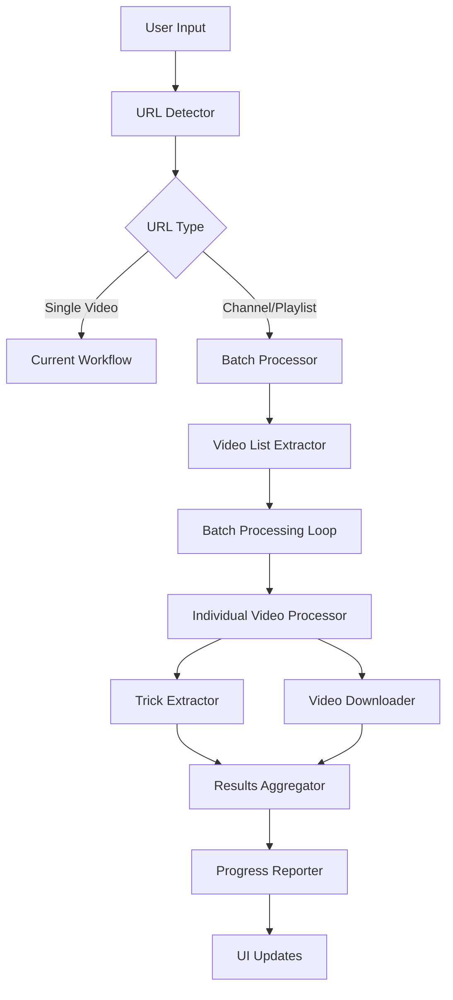

# Design Document

## Overview

The batch processing enhancement extends the YouTube Tools application to support processing entire channels and playlists while maintaining backward compatibility with single video processing. The design introduces a new batch processing workflow, enhanced UI components for progress tracking, and a robust error handling system.

## Architecture

### High-Level Architecture



### Component Interaction

The new architecture introduces several new components while preserving existing functionality:

1. **URL Detector**: Determines if input is single video, channel, or playlist
2. **Batch Processor**: Coordinates the processing of multiple videos
3. **Video List Extractor**: Retrieves video lists from channels/playlists
4. **Progress Reporter**: Manages progress updates and user feedback
5. **Results Aggregator**: Collects and summarizes batch processing results

## Components and Interfaces

### 1. URL Detection Module

**Location**: `ytsummarizer/url_detector.py` (new module)

```python
class URLDetector:
    def detect_url_type(self, url: str) -> URLType
    def extract_source_id(self, url: str) -> str
    def validate_url(self, url: str) -> bool

enum URLType:
    SINGLE_VIDEO
    CHANNEL
    PLAYLIST
    INVALID
```

**Responsibilities**:
- Detect URL type (video, channel, playlist)
- Extract relevant IDs from URLs
- Validate URL format and accessibility

### 2. Batch Processor Module

**Location**: `ytsummarizer/batch_processor.py` (new module)

```python
class BatchProcessor:
    def __init__(self, progress_callback, cancel_token)
    def process_source(self, source_url: str, options: BatchOptions) -> BatchResult
    def process_video_list(self, videos: List[VideoInfo], source_info: SourceInfo) -> BatchResult
    def create_folder_structure(self, source_info: SourceInfo, video_info: VideoInfo) -> str

class BatchOptions:
    max_videos: int = 50
    skip_existing: bool = False
    date_filter: Optional[DateRange] = None
    duration_filter: Optional[DurationRange] = None

class BatchResult:
    total_videos: int
    processed_videos: int
    successful_extractions: int
    total_tricks: int
    errors: List[ProcessingError]
    processing_time: float
```

**Responsibilities**:
- Coordinate batch processing workflow
- Manage processing options and filters
- Aggregate results and errors
- Handle cancellation requests

### 3. Enhanced Video List Extractor

**Location**: `ytsummarizer/transcripts.py` (enhanced existing module)

```python
# New functions to add:
def get_channel_info(channel_url: str) -> ChannelInfo
def get_playlist_info(playlist_url: str) -> PlaylistInfo
def extract_video_list(source_url: str, limit: int = None) -> List[VideoInfo]
def get_source_metadata(source_url: str) -> SourceInfo

class SourceInfo:
    name: str
    type: URLType
    total_videos: int
    description: str
    
class VideoInfo:
    video_id: str
    title: str
    duration: int
    upload_date: datetime
    url: str
```

**Responsibilities**:
- Extract video lists from channels and playlists
- Retrieve metadata about sources
- Handle pagination for large sources
- Filter videos based on criteria

### 4. Enhanced UI Components

**Location**: `ytsummarizer/ui.py` (enhanced existing module)

**New UI Elements**:
- Overall progress bar
- Current video progress indicator
- Processing status label
- Cancel button
- Batch settings panel
- Results summary dialog

```python
class BatchProgressWidget(QWidget):
    def __init__(self)
    def update_overall_progress(self, current: int, total: int)
    def update_current_video(self, video_title: str, progress: float)
    def show_processing_status(self, status: str)

class BatchSettingsDialog(QDialog):
    def __init__(self)
    def get_batch_options(self) -> BatchOptions

class BatchResultsDialog(QDialog):
    def __init__(self, results: BatchResult)
    def show_summary(self)
    def show_errors(self)
```

### 5. Enhanced Video Processor

**Location**: `ytsummarizer/video_processor.py` (enhanced existing module)

```python
# Enhanced function signature:
def extract_video_segments(
    video_id: str, 
    segments: list[dict], 
    output_dir: str = "tricks",
    source_info: SourceInfo = None,
    video_info: VideoInfo = None
) -> list[str]

# New function:
def create_nested_folder_structure(
    base_dir: str,
    source_info: SourceInfo,
    video_info: VideoInfo
) -> str
```

**Enhancements**:
- Support for nested folder structure
- Integration with batch processing workflow
- Enhanced error handling for batch scenarios

## Data Models

### Core Data Structures

```python
@dataclass
class SourceInfo:
    name: str
    type: URLType
    url: str
    total_videos: int
    description: Optional[str] = None

@dataclass
class VideoInfo:
    video_id: str
    title: str
    duration: Optional[int] = None
    upload_date: Optional[datetime] = None
    url: str
    thumbnail_url: Optional[str] = None

@dataclass
class ProcessingError:
    video_id: str
    video_title: str
    error_type: str
    error_message: str
    timestamp: datetime

@dataclass
class VideoProcessingResult:
    video_info: VideoInfo
    tricks_found: int
    segments_extracted: List[str]
    processing_time: float
    success: bool
    error: Optional[ProcessingError] = None
```

### Folder Structure Model

```
tricks/
├── [Source Name]/
│   ├── [Video 1 Title]/
│   │   ├── trick_1_00-01-30_(15.2s).mp4
│   │   └── trick_2_00-05-45_(12.8s).mp4
│   ├── [Video 2 Title]/
│   │   └── trick_1_00-02-15_(18.5s).mp4
│   └── processing_log.txt
└── [Another Source]/
    └── ...
```

## Error Handling

### Error Categories

1. **Network Errors**: Connection issues, API rate limits
2. **Access Errors**: Private videos, geo-restricted content
3. **Processing Errors**: Transcript extraction failures, video download issues
4. **System Errors**: Disk space, permission issues

### Error Handling Strategy

```python
class ErrorHandler:
    def handle_video_error(self, error: Exception, video_info: VideoInfo) -> ProcessingError
    def should_continue_batch(self, error_rate: float) -> bool
    def log_error(self, error: ProcessingError)
    def generate_error_report(self, errors: List[ProcessingError]) -> str
```

**Error Recovery**:
- Individual video failures don't stop batch processing
- Automatic retry for transient network errors
- Detailed error logging for troubleshooting
- User-friendly error summaries

## Testing Strategy

### Unit Tests

1. **URL Detection Tests**:
   - Test various YouTube URL formats
   - Test invalid URL handling
   - Test edge cases (short URLs, embedded URLs)

2. **Batch Processing Tests**:
   - Test small playlist processing
   - Test error handling scenarios
   - Test cancellation functionality

3. **Folder Structure Tests**:
   - Test folder name sanitization
   - Test nested folder creation
   - Test duplicate handling

### Integration Tests

1. **End-to-End Batch Processing**:
   - Test complete workflow with real playlists
   - Test UI responsiveness during processing
   - Test result accuracy and completeness

2. **Error Scenario Tests**:
   - Test network interruption handling
   - Test private video handling
   - Test disk space exhaustion

### Performance Tests

1. **Large Batch Tests**:
   - Test processing 50+ video playlists
   - Test memory usage during batch processing
   - Test UI responsiveness with large batches

2. **Resource Usage Tests**:
   - Monitor CPU and memory usage
   - Test concurrent processing limits
   - Test disk I/O efficiency

## Implementation Phases

### Phase 1: Core Batch Processing (Week 1-2)
- Implement URL detection
- Create batch processor module
- Enhance video list extraction
- Basic batch processing without UI changes

### Phase 2: UI Enhancement (Week 3)
- Add progress indicators
- Implement cancellation
- Create batch settings dialog
- Add results summary

### Phase 3: Advanced Features (Week 4-5)
- Add filtering options
- Implement resume capability
- Enhanced error handling
- Performance optimizations

### Phase 4: Testing and Polish (Week 6)
- Comprehensive testing
- Bug fixes and optimizations
- Documentation updates
- User acceptance testing

## Security Considerations

1. **Input Validation**: Validate all URLs before processing
2. **Resource Limits**: Prevent excessive resource consumption
3. **Error Information**: Avoid exposing sensitive information in error messages
4. **File System Security**: Sanitize all folder and file names

## Performance Considerations

1. **Sequential Processing**: Process videos one at a time to avoid overwhelming resources
2. **Caching**: Leverage existing transcript caching
3. **Memory Management**: Process videos individually to minimize memory usage
4. **Network Efficiency**: Implement reasonable delays between requests

## Backward Compatibility

The design ensures complete backward compatibility:
- Single video URLs continue to work as before
- Existing folder structure preserved for single videos
- All current UI elements remain functional
- No breaking changes to existing APIs

## Configuration Options

```python
class BatchConfig:
    DEFAULT_MAX_VIDEOS = 50
    DEFAULT_TIMEOUT = 300  # 5 minutes per video
    MAX_CONCURRENT_DOWNLOADS = 1
    RETRY_ATTEMPTS = 3
    PROGRESS_UPDATE_INTERVAL = 1.0  # seconds
```

These configuration options allow fine-tuning of batch processing behavior while maintaining reasonable defaults for most users.