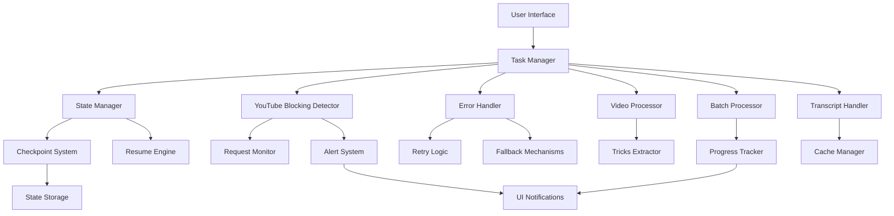

# Design Document

## Overview

The Claude v3.0 improvements enhance the YouTube Transcript and Summarization Tool with robust error handling, processing resumption capabilities, comprehensive testing, and improved user experience. The design integrates the existing YouTubeBlockingDetector, implements state management for resumption, and creates a resilient architecture that can handle various failure scenarios while maintaining data integrity.

## Architecture

### High-Level Architecture



### Component Integration

The enhanced architecture maintains backward compatibility while adding new resilience layers:

1. **State Manager**: Tracks processing state and manages checkpoints
2. **Enhanced Task Manager**: Coordinates all processing with resumption support
3. **Integrated Blocking Detection**: Monitors all YouTube API interactions
4. **Comprehensive Error Handling**: Unified error processing with retry logic
5. **Alert System**: User-friendly notifications and guidance

## Components and Interfaces

### 1. State Management System

**Location**: `ytsummarizer/state_manager.py` (enhanced)

```python
class ProcessingState:
    """Represents the current state of a processing operation."""
    session_id: str
    operation_type: str  # 'batch', 'single', 'tricks_extraction'
    start_time: datetime
    total_items: int
    completed_items: List[str]
    failed_items: List[Dict]
    current_item: Optional[str]
    checkpoint_data: Dict
    resumable: bool

class StateManager:
    """Enhanced state management with resumption capabilities."""
    
    def create_session(self, operation_type: str, items: List[str]) -> str:
        """Create new processing session with unique ID."""
        
    def save_checkpoint(self, session_id: str, current_item: str, 
                       completed: List[str], failed: List[Dict]):
        """Save processing checkpoint to persistent storage."""
        
    def load_session(self, session_id: str) -> Optional[ProcessingState]:
        """Load existing processing session."""
        
    def get_resumable_sessions(self) -> List[ProcessingState]:
        """Get all sessions that can be resumed."""
        
    def mark_session_complete(self, session_id: str):
        """Mark session as completed and clean up."""
        
    def cleanup_old_sessions(self, days: int = 7):
        """Clean up old session data."""
```

### 2. Enhanced Task Manager

**Location**: `ytsummarizer/task_manager.py` (new)

```python
class TaskManager:
    """Coordinates all processing tasks with resumption support."""
    
    def __init__(self):
        self.state_manager = StateManager()
        self.blocking_detector = YouTubeBlockingDetector()
        self.error_handler = ErrorHandler()
        self.current_session: Optional[str] = None
        
    def start_batch_processing(self, urls: List[str], 
                             resume_session: Optional[str] = None) -> str:
        """Start or resume batch processing."""
        
    def start_tricks_extraction(self, video_url: str,
                              resume_session: Optional[str] = None) -> str:
        """Start or resume tricks extraction."""
        
    def pause_processing(self) -> bool:
        """Gracefully pause current processing."""
        
    def resume_processing(self, session_id: str) -> bool:
        """Resume paused processing session."""
        
    def stop_processing(self) -> Dict:
        """Stop processing and return results."""
        
    def get_processing_status(self) -> Dict:
        """Get current processing status and statistics."""
```

### 3. Integrated Error Handling

**Location**: `ytsummarizer/error_handler.py` (new)

```python
class ErrorCategory(Enum):
    NETWORK_ERROR = "network"
    RATE_LIMIT = "rate_limit"
    BLOCKING = "blocking"
    TRANSCRIPT_ERROR = "transcript"
    VIDEO_ERROR = "video"
    SYSTEM_ERROR = "system"

class ErrorHandler:
    """Unified error handling with retry logic and user guidance."""
    
    def __init__(self, blocking_detector: YouTubeBlockingDetector):
        self.blocking_detector = blocking_detector
        self.retry_config = RetryConfig()
        
    def handle_error(self, error: Exception, context: Dict) -> ErrorResult:
        """Process error and determine appropriate action."""
        
    def should_retry(self, error: Exception, attempt: int) -> bool:
        """Determine if operation should be retried."""
        
    def get_retry_delay(self, error: Exception, attempt: int) -> int:
        """Calculate delay before retry."""
        
    def categorize_error(self, error: Exception) -> ErrorCategory:
        """Categorize error for appropriate handling."""
        
    def get_user_message(self, error: Exception) -> str:
        """Get user-friendly error message."""
        
    def get_resolution_steps(self, error: Exception) -> List[str]:
        """Get recommended steps to resolve error."""
```

### 4. Enhanced Video Processor

**Location**: `ytsummarizer/video_processor.py` (enhanced)

```python
class VideoProcessor:
    """Enhanced video processor with resumption and error handling."""
    
    def __init__(self, task_manager: TaskManager):
        self.task_manager = task_manager
        self.error_handler = task_manager.error_handler
        
    def extract_tricks_with_resumption(self, video_url: str, 
                                     session_id: Optional[str] = None) -> Dict:
        """Extract tricks with checkpoint support."""
        
    def process_video_segment(self, video_url: str, start_time: float, 
                            end_time: float, output_path: str) -> bool:
        """Process individual video segment with error handling."""
        
    def validate_existing_files(self, expected_files: List[str]) -> List[str]:
        """Validate existing files and return list of missing/corrupted files."""
```

### 5. Enhanced UI Components

**Location**: `ytsummarizer/ui.py` (enhanced)

```python
class ProcessingStatusWidget(QWidget):
    """Enhanced status widget with resumption controls."""
    
    def __init__(self):
        self.setup_ui()
        self.setup_resumption_controls()
        
    def show_resumable_sessions(self):
        """Display dialog with resumable sessions."""
        
    def show_blocking_alert(self, alert: BlockingAlert):
        """Display blocking alert with resolution guidance."""
        
    def update_processing_status(self, status: Dict):
        """Update UI with current processing status."""

class ResumptionDialog(QDialog):
    """Dialog for selecting and managing resumable sessions."""
    
    def __init__(self, sessions: List[ProcessingState]):
        self.sessions = sessions
        self.setup_ui()
        
    def get_selected_session(self) -> Optional[str]:
        """Get user-selected session to resume."""
```

## Data Models

### Processing State Storage

```json
{
  "session_id": "batch_20250720_143022_abc123",
  "operation_type": "batch_processing",
  "start_time": "2025-07-20T14:30:22Z",
  "total_items": 25,
  "completed_items": [
    {
      "video_id": "dQw4w9WgXcQ",
      "url": "https://youtu.be/dQw4w9WgXcQ",
      "completed_at": "2025-07-20T14:32:15Z",
      "tricks_found": 3,
      "output_files": ["trick_1.mp4", "trick_2.mp4", "trick_3.mp4"]
    }
  ],
  "failed_items": [
    {
      "video_id": "xyz789",
      "url": "https://youtu.be/xyz789",
      "error": "Rate limit exceeded",
      "error_category": "rate_limit",
      "failed_at": "2025-07-20T14:35:10Z",
      "retry_count": 2
    }
  ],
  "current_item": {
    "video_id": "abc456",
    "url": "https://youtu.be/abc456",
    "started_at": "2025-07-20T14:36:00Z",
    "progress": "extracting_tricks"
  },
  "checkpoint_data": {
    "last_checkpoint": "2025-07-20T14:35:45Z",
    "processing_options": {
      "output_folder": "/path/to/tricks",
      "max_retries": 3,
      "skip_existing": true
    }
  },
  "resumable": true,
  "status": "paused"
}
```

### Error Tracking Data

```json
{
  "error_id": "err_20250720_143500_001",
  "session_id": "batch_20250720_143022_abc123",
  "video_id": "xyz789",
  "error_type": "HTTPError",
  "error_category": "rate_limit",
  "status_code": 429,
  "error_message": "Too Many Requests",
  "context": {
    "operation": "get_transcript",
    "attempt": 2,
    "total_attempts": 3
  },
  "timestamp": "2025-07-20T14:35:00Z",
  "resolution_attempted": ["wait_and_retry", "exponential_backoff"],
  "user_notified": true
}
```

## Error Handling Strategy

### Error Classification and Response

1. **Transient Errors** (Network, Rate Limiting)
   - Automatic retry with exponential backoff
   - User notification after multiple failures
   - Checkpoint before retry attempts

2. **Blocking Errors** (IP Block, API Restrictions)
   - Immediate user notification with guidance
   - Processing pause with resumption option
   - Integration with YouTubeBlockingDetector

3. **Data Errors** (Invalid URLs, Missing Transcripts)
   - Skip item and continue processing
   - Log detailed error information
   - Include in final error report

4. **System Errors** (File I/O, Memory Issues)
   - Attempt recovery if possible
   - Create checkpoint before failure
   - Provide user options for continuation

### Retry Logic Implementation

```python
class RetryConfig:
    max_retries: int = 3
    base_delay: float = 1.0
    max_delay: float = 60.0
    exponential_base: float = 2.0
    jitter: bool = True
    
    def get_delay(self, attempt: int) -> float:
        """Calculate delay with exponential backoff and jitter."""
        delay = min(self.base_delay * (self.exponential_base ** attempt), 
                   self.max_delay)
        if self.jitter:
            delay += random.uniform(0, delay * 0.1)
        return delay
```

## Testing Strategy

### Unit Testing Framework

1. **State Management Tests**
   - Session creation and persistence
   - Checkpoint save/load operations
   - Session cleanup and validation

2. **Error Handling Tests**
   - Error categorization accuracy
   - Retry logic validation
   - User message generation

3. **Integration Tests**
   - End-to-end processing workflows
   - Resumption after various failure types
   - UI component interactions

### Mock Testing Scenarios

1. **YouTube API Mocking**
   - Rate limiting responses (HTTP 429)
   - Blocking responses (HTTP 403)
   - Network timeout scenarios
   - Invalid response formats

2. **File System Mocking**
   - Disk space limitations
   - Permission errors
   - Corrupted file scenarios

3. **Processing Interruption Simulation**
   - Application crashes during processing
   - Network disconnections
   - User-initiated stops

## Performance Considerations

### Resource Management

1. **Memory Optimization**
   - Process videos individually to limit memory usage
   - Clean up temporary files after each video
   - Implement garbage collection triggers

2. **Network Efficiency**
   - Implement request rate limiting
   - Use connection pooling for HTTP requests
   - Cache transcript data effectively

3. **Storage Optimization**
   - Compress checkpoint data
   - Implement automatic cleanup of old sessions
   - Use efficient file formats for state storage

### Scalability Features

1. **Batch Size Management**
   - Configurable batch sizes based on system resources
   - Dynamic adjustment based on error rates
   - Progress tracking for large batches

2. **Concurrent Processing**
   - Thread-safe state management
   - Proper synchronization for UI updates
   - Resource pooling for video processing

## Security Considerations

1. **Data Protection**
   - Encrypt sensitive data in state files
   - Secure storage of API keys and cookies
   - Validate all user inputs

2. **File System Security**
   - Sanitize file paths and names
   - Validate output directories
   - Prevent directory traversal attacks

3. **Network Security**
   - Validate URLs before processing
   - Implement request timeouts
   - Handle SSL/TLS errors appropriately

## Backward Compatibility

The design ensures complete backward compatibility:

1. **Existing Functionality**
   - All current features remain unchanged
   - Existing UI elements maintain same behavior
   - Configuration files remain compatible

2. **Optional Enhancements**
   - Resumption features are opt-in
   - Enhanced error handling is transparent
   - New UI elements are additive

3. **Migration Strategy**
   - Automatic detection of old processing sessions
   - Graceful handling of legacy state data
   - Progressive enhancement of existing features

## Implementation Phases

### Phase 1: Core Infrastructure (Week 1-2)
- Implement enhanced StateManager
- Create TaskManager with basic resumption
- Integrate YouTubeBlockingDetector
- Basic error handling framework

### Phase 2: Processing Enhancement (Week 3-4)
- Enhanced VideoProcessor with checkpoints
- Improved transcript handling with retries
- Batch processing with resumption
- Error categorization and handling

### Phase 3: UI Enhancement (Week 5)
- Resumption dialog and controls
- Enhanced progress indicators
- Blocking alert system
- Status and error reporting

### Phase 4: Testing and Polish (Week 6-7)
- Comprehensive test suite
- Performance optimization
- Documentation updates
- Bug fixes and refinements