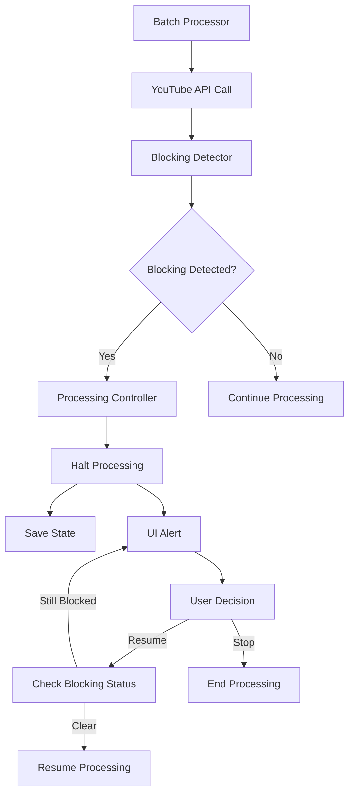

# YouTube Blocking Detection & Response Design

## Overview

This design addresses the critical issue where the YouTube transcription system continues processing even after detecting IP blocks or rate limiting. The solution involves enhancing the blocking detection system, implementing immediate halt mechanisms, and improving user communication.

## Architecture

### Core Components

1. **Enhanced Blocking Detector** - Improved detection with immediate response triggers
2. **Processing Controller** - Central component to halt/resume processing based on blocking status
3. **UI Alert System** - Enhanced user interface for blocking notifications and actions
4. **Blocking-Aware Retry Manager** - Retry logic that respects blocking status
5. **State Preservation System** - Saves progress when processing is halted due to blocking

### Component Interactions



## Components and Interfaces

### 1. Enhanced Blocking Detector

**Purpose**: Detect blocking patterns and trigger immediate responses

**Key Enhancements**:
- Add message pattern detection for IP blocking messages
- Implement immediate halt triggers for critical blocking
- Add blocking severity escalation logic

**Interface**:
```python
class YouTubeBlockingDetector:
    def should_halt_processing(self) -> bool
    def get_halt_reason(self) -> str
    def is_blocking_cleared(self) -> bool
    def get_user_action_options(self) -> List[str]
```

### 2. Processing Controller

**Purpose**: Central control for halting and resuming processing based on blocking status

**Responsibilities**:
- Monitor blocking detector status
- Halt batch processing when critical blocking detected
- Coordinate state saving during halts
- Manage processing resumption

**Interface**:
```python
class ProcessingController:
    def check_blocking_status(self) -> BlockingStatus
    def halt_processing(self, reason: str) -> None
    def can_resume_processing(self) -> bool
    def resume_processing(self) -> None
```

### 3. Enhanced UI Alert System

**Purpose**: Provide clear, actionable blocking notifications to users

**Features**:
- Prominent blocking alerts with specific messages
- Action buttons for user response (Wait/Retry/Stop)
- Progress preservation indicators
- Blocking resolution guidance

**Interface**:
```python
class BlockingAlertWidget:
    def show_critical_blocking_alert(self, alert: BlockingAlert) -> None
    def show_user_action_options(self, options: List[str]) -> str
    def update_blocking_status(self, status: str) -> None
```

### 4. Blocking-Aware Retry Manager

**Purpose**: Prevent retries when blocking is active

**Enhancements**:
- Check blocking status before attempting retries
- Mark operations as non-retryable when blocking detected
- Implement blocking-aware delay calculations

**Interface**:
```python
class RetryManager:
    def should_retry_with_blocking_check(self, error: Exception) -> bool
    def is_operation_blocked(self, operation_type: str) -> bool
    def get_blocking_aware_delay(self, attempt: int) -> float
```

## Data Models

### BlockingStatus Enum
```python
class BlockingStatus(Enum):
    CLEAR = "clear"
    WARNING = "warning"
    CRITICAL_RATE_LIMIT = "critical_rate_limit"
    CRITICAL_IP_BLOCK = "critical_ip_block"
    HALTED = "halted"
```

### ProcessingHaltReason
```python
@dataclass
class ProcessingHaltReason:
    reason_type: BlockingStatus
    message: str
    recommended_action: str
    estimated_wait_time: Optional[int]
    can_resume: bool
```

### UserActionResponse
```python
@dataclass
class UserActionResponse:
    action: str  # "wait_and_retry", "stop_processing", "change_ip"
    wait_time: Optional[int]
    user_message: Optional[str]
```

## Error Handling

### Blocking Detection Errors
- **Pattern**: Failed to detect blocking properly
- **Response**: Log warning, continue with conservative blocking assumptions
- **Recovery**: Manual blocking status reset option

### State Saving Errors During Halt
- **Pattern**: Cannot save state when halting due to blocking
- **Response**: Attempt alternative state storage, warn user
- **Recovery**: Manual state recovery options

### UI Communication Errors
- **Pattern**: Cannot display blocking alerts to user
- **Response**: Log critical alerts, attempt console output
- **Recovery**: Fallback to automatic conservative behavior

## Testing Strategy

### Unit Tests
1. **Blocking Detector Tests**
   - Test pattern recognition for different blocking messages
   - Test halt trigger conditions
   - Test blocking status transitions

2. **Processing Controller Tests**
   - Test halt/resume logic
   - Test state preservation during halts
   - Test blocking status monitoring

3. **Retry Manager Tests**
   - Test blocking-aware retry decisions
   - Test operation marking as non-retryable
   - Test delay calculations with blocking

### Integration Tests
1. **End-to-End Blocking Response**
   - Simulate IP blocking scenario
   - Verify immediate processing halt
   - Test user notification and response flow

2. **State Preservation Tests**
   - Test state saving during blocking halt
   - Test successful resumption after blocking cleared
   - Test multiple halt/resume cycles

### User Interface Tests
1. **Alert Display Tests**
   - Test blocking alert visibility and clarity
   - Test user action button functionality
   - Test status updates during blocking resolution

## Implementation Phases

### Phase 1: Enhanced Blocking Detection
- Improve blocking pattern recognition
- Add immediate halt triggers
- Implement blocking status monitoring

### Phase 2: Processing Control
- Implement processing controller
- Add halt/resume mechanisms
- Integrate with batch processor

### Phase 3: UI Enhancements
- Enhanced blocking alerts
- User action options
- Status monitoring display

### Phase 4: Retry Logic Integration
- Blocking-aware retry decisions
- Operation blocking status
- Intelligent delay calculations

### Phase 5: Testing & Validation
- Comprehensive testing suite
- User acceptance testing
- Performance validation

## Security Considerations

- **Rate Limit Respect**: Ensure the system doesn't attempt to circumvent YouTube's rate limiting
- **IP Blocking Response**: Provide guidance for legitimate IP address changes
- **User Privacy**: Don't log sensitive user information in blocking alerts

## Performance Considerations

- **Immediate Response**: Blocking detection should trigger halts within seconds
- **State Saving**: State preservation should be fast to avoid data loss
- **UI Responsiveness**: Blocking alerts should not freeze the interface
- **Memory Usage**: Blocking detection should not consume excessive memory

## Monitoring and Logging

- **Blocking Events**: Log all blocking detection events with timestamps
- **Halt/Resume Events**: Track processing interruptions and resumptions
- **User Actions**: Log user responses to blocking alerts
- **Performance Metrics**: Monitor blocking detection accuracy and response times