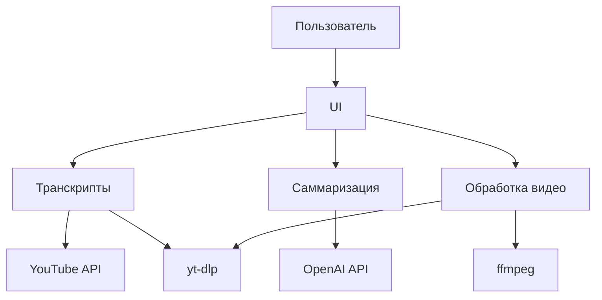

# YouTube Инструменты: Проект документация

## Общее описание проекта

YouTube Инструменты — это приложение для работы с видео с платформы YouTube, предоставляющее функциональность для транскрипции, саммаризации и извлечения трюков из видеороликов. Приложение разработано с использованием Python и PyQt5 для создания графического интерфейса пользователя.

## Цели проекта

1. **Автоматизация работы с контентом YouTube** — предоставление инструментов для быстрого извлечения полезной информации из видеороликов.
2. **Саммаризация видео** — создание кратких резюме содержания видео на основе транскриптов с использованием OpenAI API.
3. **Извлечение трюков** — автоматическое определение и извлечение сегментов видео, содержащих трюки или другие значимые моменты.
4. **Высокое качество обработки** — обеспечение максимального качества скачиваемых видео и их сегментов.

## Архитектура проекта

### Общая структура

Проект организован в модульную структуру с четким разделением ответственности между компонентами:

```
│
├─ ytsummarizer/          # пакет с исходниками
│   ├─ app.py             # точка входа GUI
│   ├─ ui.py              # PyQt интерфейс
│   ├─ transcripts.py     # получение субтитров
│   ├─ summarizer.py      # вызов OpenAI
│   └─ video_processor.py # обработка видео в HD, извлечение трюков
│
├─ scripts/               # вспомогательные утилиты (включая тесты)
│   ├─ test_video_processor.py # тесты для video_processor
│   └─ verify_cookies.py  # проверка YouTube cookies
├─ cookies.txt            # (опционально) экспорт YouTube cookies
├─ main.py                # обёртка для обратной совместимости
└─ run.bat                # запуск под Windows
```

### Компоненты системы

1. **Модуль UI (`ui.py`)** — отвечает за графический интерфейс пользователя, обработку пользовательских действий и отображение результатов.
2. **Модуль транскриптов (`transcripts.py`)** — отвечает за получение и обработку субтитров с YouTube, включая кэширование и поддержку различных языков.
3. **Модуль саммаризации (`summarizer.py`)** — взаимодействует с OpenAI API для создания кратких резюме видео на основе транскриптов.
4. **Модуль обработки видео (`video_processor.py`)** — отвечает за извлечение трюков из видео и скачивание видеосегментов в высоком качестве.
5. **Точка входа (`app.py`)** — инициализирует приложение и запускает графический интерфейс.

### Диаграмма взаимодействия компонентов



## Технологический стек

### Основные технологии

1. **Python** — основной язык программирования
2. **PyQt5** — библиотека для создания графического интерфейса
3. **youtube_transcript_api** — библиотека для получения транскриптов с YouTube
4. **yt-dlp** — библиотека для скачивания видео с YouTube
5. **ffmpeg** — инструмент для обработки видео
6. **OpenAI API** — для саммаризации текста

### Зависимости

Все зависимости указаны в файле `requirements.txt`:
- PyQt5
- requests
- youtube_transcript_api
- yt-dlp

Дополнительно требуется установка ffmpeg и настройка переменной окружения OPENAI_API_KEY.

## Функциональные требования

### Основные функции

1. **Саммаризация видео**
   - Получение транскрипта видео с YouTube
   - Обработка транскрипта с использованием OpenAI API
   - Отображение результата саммаризации

2. **Извлечение трюков**
   - Анализ транскрипта для определения "тихих" участков
   - Идентификация сегментов видео, потенциально содержащих трюки
   - Отображение списка найденных трюков с таймкодами

3. **Скачивание видео трюков**
   - Скачивание полного видео в максимальном качестве
   - Извлечение сегментов с трюками с сохранением качества
   - Сохранение сегментов в отдельные файлы

### Дополнительные функции

1. **Кэширование транскриптов** — для ускорения повторной работы с одним и тем же видео
2. **Поддержка приватных/возраст-ограниченных видео** — через использование cookies
3. **Поддержка различных языков** — приоритет русского и английского языков
4. **Fallback механизмы** — альтернативные способы получения транскриптов при недоступности основного метода

## Нефункциональные требования

### Производительность

1. **Оптимизация кэширования** — хранение транскриптов для ускорения повторных запросов
2. **Эффективная обработка видео** — использование `-c copy` в ffmpeg для сохранения качества без перекодирования

### Безопасность

1. **Безопасное хранение API ключей** — использование переменных окружения
2. **Безопасное хранение cookies** — предупреждение пользователей о необходимости защиты файла cookies.txt

### Удобство использования

1. **Интуитивный интерфейс** — четкое разделение функций в UI
2. **Информативные сообщения об ошибках** — понятные пользователю объяснения проблем
3. **Настройка размера шрифта** — для улучшения читаемости

### Надежность

1. **Обработка ошибок** — корректная обработка исключений во всех модулях
2. **Альтернативные методы получения данных** — fallback на yt-dlp при недоступности youtube_transcript_api

## Этапы разработки

### Текущий статус

Проект находится в стадии активной разработки с реализованными основными функциями:
- Саммаризация видео
- Извлечение трюков
- Скачивание видео трюков

### Планируемые улучшения

1. **Расширение функциональности Q&A** — возможность задавать вопросы по содержанию видео
2. **Улучшение алгоритма определения трюков** — более точное определение значимых сегментов
3. **Поддержка пакетной обработки** — возможность работы с несколькими видео одновременно
4. **Улучшение UI** — добавление прогресс-баров и дополнительных настроек

## Стандарты кодирования

1. **Структура модулей** — четкое разделение ответственности между модулями
2. **Документация кода** — использование docstrings для функций и классов
3. **Обработка ошибок** — корректная обработка и логирование исключений
4. **Именование переменных** — использование понятных имен на русском или английском языках
5. **Комментарии** — объяснение сложных алгоритмов и решений

## Требования к консистентности

1. **Единый стиль кодирования** — соблюдение PEP 8
2. **Согласованный UI** — единый стиль элементов интерфейса
3. **Согласованная обработка ошибок** — единый подход к обработке и отображению ошибок
4. **Согласованное логирование** — единый формат логов

## Требования к поддерживаемости

1. **Модульная архитектура** — возможность легкой замены или обновления отдельных компонентов
2. **Тестирование** — наличие тестов для ключевых функций
3. **Документация** — поддержание актуальной документации
4. **Версионирование** — четкое отслеживание изменений

## Системные требования

1. **Python 3.6+**
2. **ffmpeg** — установленный и доступный в PATH
3. **Доступ к интернету** — для взаимодействия с YouTube и OpenAI API
4. **Переменная окружения OPENAI_API_KEY** — для доступа к OpenAI API
5. **Опционально: cookies.txt** — для доступа к приватным/возраст-ограниченным видео

## Инструкции по установке и запуску

### Установка

1. Клонировать репозиторий
2. Установить зависимости: `pip install -r requirements.txt`
3. Установить ffmpeg и добавить его в PATH
4. Настроить переменную окружения OPENAI_API_KEY
5. Опционально: создать файл cookies.txt с cookies YouTube

### Запуск

1. Через командную строку: `python -m ytsummarizer.app`
2. Через bat-файл: `run.bat`
3. Через ярлык на рабочем столе (см. инструкции в README.md)

## Система отслеживания прогресса

Для отслеживания прогресса разработки используется следующая система:

### Статусы задач

1. **Планируется** — задача определена, но работа не начата
2. **В разработке** — задача находится в активной разработке
3. **На тестировании** — задача реализована и проходит тестирование
4. **Завершено** — задача полностью реализована и протестирована

### Приоритеты задач

1. **Критический** — блокирующие задачи, требующие немедленного внимания
2. **Высокий** — важные задачи, необходимые для следующего релиза
3. **Средний** — задачи, которые должны быть выполнены, но не блокируют работу
4. **Низкий** — задачи, которые можно отложить

### Текущие задачи

| ID | Задача | Статус | Приоритет | Ответственный |
|----|--------|--------|-----------|--------------|
| 1 | Улучшение алгоритма определения трюков | Планируется | Высокий | - |
| 2 | Добавление прогресс-баров в UI | Планируется | Средний | - |
| 3 | Реализация функциональности Q&A | Планируется | Средний | - |
| 4 | Поддержка пакетной обработки видео | Планируется | Низкий | - |
| 5 | Улучшение документации | В разработке | Высокий | - |

## Заключение

Проект "YouTube Инструменты" представляет собой многофункциональное приложение для работы с видео с YouTube, предоставляющее возможности для транскрипции, саммаризации и извлечения трюков. Проект имеет модульную архитектуру, что обеспечивает его гибкость и расширяемость. Текущая версия реализует основные функции, но планируется дальнейшее развитие и улучшение.